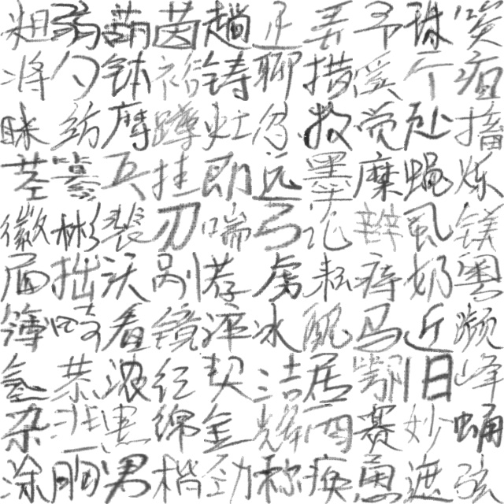

# hand-writing-recognition
基于pytorch卷积神经网络的中文手写汉字识别，使用HWDB数据库

## Dependence
* PIL
* numpy
* torch
* torchvision
* tensorboardX(for visulizztion)

## Usage
1. Download HWDB dataset and unzip to `data` folder
2. run `python process_gnt.py` to generate img from gnt fiel. Due to the huge dataset (897758+223991 images), it may take a lot of time. I suggest to put the data folder out of project or your pycharm will get slow.
3. run `python hwdb.py` to visualize the image.
4. run `python train.py` to start trianing.

